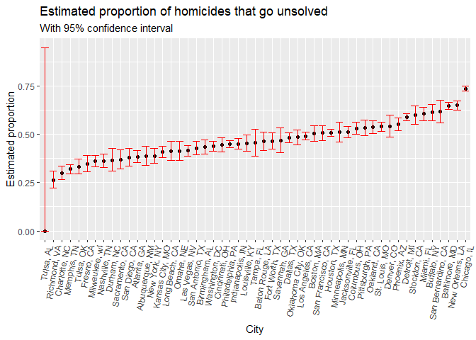
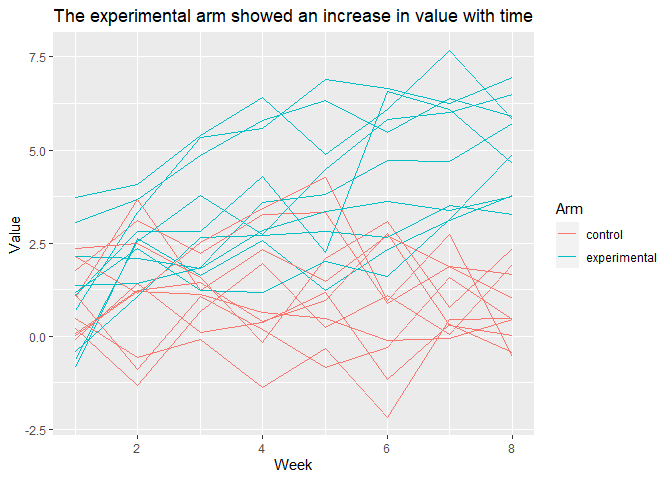

p8105_hw5_geg2145
================
Gustavo Garcia-Franceschini
2023-11-13

# Problem 1

The Washington Post has gathered data on homicides in 50 large U.S.
cities and made the data available through a GitHub repository.

``` r
df_homicide = read_csv("./data/homicide_data.csv")
```

    ## Rows: 52179 Columns: 12
    ## ── Column specification ────────────────────────────────────────────────────────
    ## Delimiter: ","
    ## chr (9): uid, victim_last, victim_first, victim_race, victim_age, victim_sex...
    ## dbl (3): reported_date, lat, lon
    ## 
    ## ℹ Use `spec()` to retrieve the full column specification for this data.
    ## ℹ Specify the column types or set `show_col_types = FALSE` to quiet this message.

``` r
head(df_homicide, 3)
```

    ## # A tibble: 3 × 12
    ##   uid   reported_date victim_last victim_first victim_race victim_age victim_sex
    ##   <chr>         <dbl> <chr>       <chr>        <chr>       <chr>      <chr>     
    ## 1 Alb-…      20100504 GARCIA      JUAN         Hispanic    78         Male      
    ## 2 Alb-…      20100216 MONTOYA     CAMERON      Hispanic    17         Male      
    ## 3 Alb-…      20100601 SATTERFIELD VIVIANA      White       15         Female    
    ## # ℹ 5 more variables: city <chr>, state <chr>, lat <dbl>, lon <dbl>,
    ## #   disposition <chr>

**This dataset has 52179 rows and 12 columns. Each row is a homicide for
which we have the `city` and state in which it occured, and the
`disposition` (status) of the investigation.**

Describe the raw data. Create a city_state variable (e.g. “Baltimore,
MD”) and then summarize within cities to obtain the total number of
homicides and the number of unsolved homicides (those for which the
disposition is “Closed without arrest” or “Open/No arrest”).

``` r
df_homicide = df_homicide %>%
  mutate(city_state = str_c(city, ", ", state)) 

df_hom_cities = df_homicide %>%
  mutate(unsolved = as.numeric((disposition == "Closed without arrest" | 
           disposition == "Open/No arrest"))) %>%
  group_by(city_state) %>%
  summarize(unsolved_cases = sum(unsolved),
            cases = n())

head(df_hom_cities, 6)
```

    ## # A tibble: 6 × 3
    ##   city_state      unsolved_cases cases
    ##   <chr>                    <dbl> <int>
    ## 1 Albuquerque, NM            146   378
    ## 2 Atlanta, GA                373   973
    ## 3 Baltimore, MD             1825  2827
    ## 4 Baton Rouge, LA            196   424
    ## 5 Birmingham, AL             347   800
    ## 6 Boston, MA                 310   614

For the city of Baltimore, MD, use the prop.test function to estimate
the proportion of homicides that are unsolved; save the output of
prop.test as an R object, apply the broom::tidy to this object and pull
the estimated proportion and confidence intervals from the resulting
tidy dataframe.

``` r
baltimore = df_hom_cities %>%
  filter(city_state == "Baltimore, MD")
  
result = prop.test(x = pull(baltimore, unsolved_cases), 
          n = pull(baltimore,cases)) 

result %>% 
  broom::tidy() %>%
  select(estimate, conf.low, conf.high)
```

    ## # A tibble: 1 × 3
    ##   estimate conf.low conf.high
    ##      <dbl>    <dbl>     <dbl>
    ## 1    0.646    0.628     0.663

**Baltimore sees an estimated 65% of its homicides go unsolved.**

Now run prop.test for each of the cities in your dataset, and extract
both the proportion of unsolved homicides and the confidence interval
for each. Do this within a “tidy” pipeline, making use of purrr::map,
purrr::map2, list columns and unnest as necessary to create a tidy
dataframe with estimated proportions and CIs for each city.

``` r
prop_tests = df_hom_cities %>%
  mutate(test = map2(unsolved_cases, cases,  prop.test),
         result = map(test, broom::tidy)) %>%
  unnest(cols = result) %>%
  select(city_state, estimate, conf.low, conf.high)
```

    ## Warning: There was 1 warning in `mutate()`.
    ## ℹ In argument: `test = map2(unsolved_cases, cases, prop.test)`.
    ## Caused by warning in `.f()`:
    ## ! Chi-squared approximation may be incorrect

Create a plot that shows the estimates and CIs for each city – check out
geom_errorbar for a way to add error bars based on the upper and lower
limits. Organize cities according to the proportion of unsolved
homicides.

``` r
prop_tests %>%
  mutate(city_state = fct_reorder(city_state, estimate)) %>%
  ggplot(aes(x = neighborhood, y = estimate)) + 
  geom_point(aes(x = city_state, y = estimate))  + 
  geom_errorbar(aes(x= city_state, ymin = conf.low, ymax = conf.high), 
                color="red") + 
  theme(axis.text.x = element_text(angle = 80, hjust = 1)) +
  labs(title = "Estimated proportion of homicides that go unsolved",
       subtitle ="With 95% confidence interval",
       x = "City", 
       y = "Estimated proportion")
```

<!-- -->

# Problem 2

This zip file contains data from a longitudinal study that included a
control arm and an experimental arm. Data for each participant is
included in a separate file, and file names include the subject ID and
arm.

Create a tidy dataframe containing data from all participants, including
the subject ID, arm, and observations over time:

Start with a dataframe containing all file names; the list.files
function will help

Iterate over file names and read in data for each subject using
purrr::map and saving the result as a new variable in the dataframe

Tidy the result; manipulate file names to include control arm and
subject ID, make sure weekly observations are “tidy”, and do any other
tidying that’s necessary

Make a spaghetti plot showing observations on each subject over time,
and comment on differences between groups.

``` r
df_p2 =  tibble(file_name = list.files("./data/data_p2")) %>%
  mutate(data = map(str_c("./data/data_p2/", file_name), read_csv)) %>%
  unnest(cols = data) %>%
  pivot_longer(week_1: week_8,
               names_to = "week", values_to = "value") %>%
  mutate(arm = case_when(
    str_detect(file_name, "con") ~ "control",
    T ~ "experimental"),
    id = as.numeric(str_sub(file_name, start = 5, end = 6)),
    week = as.numeric(str_sub(week, start = 6, end = 6)))
    
df_p2  %>%
  ggplot() + geom_line(aes(x = week, y = value, 
                           color = arm, group = interaction(arm, id))) +
  labs(y = "Value", x= "Week", 
       title = "The experimental arm showed an increase in value with time",
       color = "Arm")
```

<!-- -->

**In the plot, we can see that the experimental arm saw an increase in
values as time went by, while the control arm remained steadily at
around 2.25.**

# Problem 3

When designing an experiment or analysis, a common question is whether
it is likely that a true effect will be detected – put differently,
whether a false null hypothesis will be rejected. The probability that a
false null hypothesis is rejected is referred to as power, and it
depends on several factors, including: the sample size; the effect size;
and the error variance. In this problem, you will conduct a simulation
to explore power in a one-sample t-test.

First set the following design elements:

Fix n=30

Fix $\sigma$=5

Set $\mu$=0

Generate 5000 datasets from the model

X ~ Normal($\mu, \sigma$)

For each dataset, save $\hat{\mu}$

and the p-value arising from a test of H: $\mu = 0$ using
$\alpha = 0.05$

Hint: to obtain the estimate and p-value, use broom::tidy to clean the
output of t.test.

Repeat the above for $\mu$={1,2,3,4,5,6}

and complete the following:

Make a plot showing the proportion of times the null was rejected (the
power of the test) on the y axis and the true value of $\mu$

on the x axis. Describe the association between effect size and power.
Make a plot showing the average estimate of $\hat{\mu}$ on the y axis
and the true value of $\mu$ on the x axis. Make a second plot (or
overlay on the first) the average estimate of $\hat{\mu}$ only in
samples for which the null was rejected on the y axis and the true value
of $\mu$ on the x axis. Is the sample average of $\hat{\mu}$ across
tests for which the null is rejected approximately equal to the true
value of $\mu$? Why or why not?
